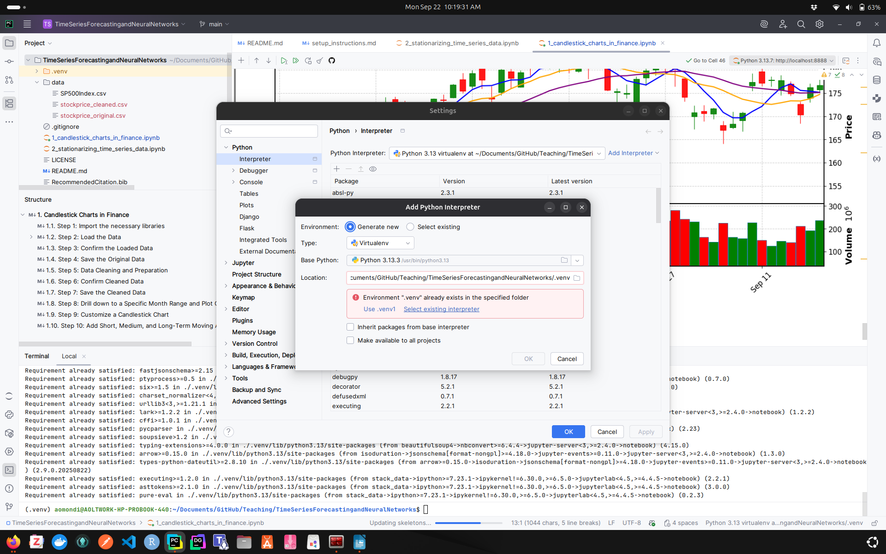
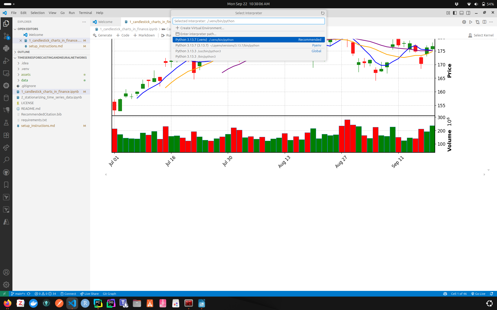

# The Virtual Environment (`.venv`) and the List of Packages File (`requirements.txt`)

## Project Setup Instructions

### Install all the packages listed in `requirements.txt` in a virtual environment

1. Confirm that you have Python installed. You can check this by running:

    ```shell
    python --version
    ```

    or

    ```shell
    python3 --version
    ```

    - If Python is not installed, download and install it from the official website: <https://www.python.org/downloads/>

2. Create and activate a **virtual environment** to keep your project dependencies isolated from the system Python packages.

   **Part A**

   - A virtual environment is like a sandbox for Python projects.
     - It is a self-contained folder that has:
       - Its own Python interpreter (a copy of the Python executable).
       - Its own set of installed packages (separate from the global system).
     - This means each project can have the exact tools and package versions it needs, without interfering with other projects or the system Python.

   - Importance of using a virtual environment:
     - Dependency Isolation
        - Each project has its own packages. Reduces cases of “project A broke because project B upgraded NumPy.”
     - Reproducibility
        - You can "freeze" your environment into a `requirements.txt` file. Others (or your future self) can recreate the same environment later.
   - Cleaner System
     - Keeps your global Python installation uncluttered. This avoids admin headaches (especially on shared machines or servers).

   - When you run `python -m venv .venv`, Python copies the interpreter into `.venv/`
   - It sets up special `bin/` (Linux/macOS) or `Scripts/` (Windows) folders with activation scripts.
   - When you activate the virtual environment (next step), your shell temporarily changes its PATH so that:
     - `python` points to `.venv/bin/python` (or `.venv\Scripts\python.exe`).
     - pip installs packages into `.venv/lib/...` instead of the global site-packages.

   - In the root of your project folder, run the following command to create the virtual environment:

    ```shell
    python -m venv .venv
    ```

   **Part B**

   - To activate the virtual environment, use the following commands:
       - For Windows (via Git Bash) - **Git Bash is the preferred option for all the labs**:

         ```shell
         source .venv/Scripts/activate
         ```

       - For Windows (via PowerShell):

         ```shell
         .venv\Scripts\Activate
         ```

         or

         ```shell
         .venv\Scripts\Activate.ps1
         ```

       - For Windows (via CMD):

         ```shell
         .venv\Scripts\activate.bat
         ```

       - For macOS/Linux:

         ```shell
         source .venv/bin/activate
         ```

       - Confirm that the virtual environment is active by executing the following
     (**use Git Bash** if you are running it on Windows OS). It should show the
     name of the virtual environment (e.g., `.venv`) as part of the output.

         ```shell
         which python
         ```

      **Part C**

   - When you create and activate a virtual environment (.venv) in your terminal, you are telling your shell to use that Python interpreter for the current session. PyCharm, however, does not automatically "see" what you did in the shell. It keeps its own record of interpreters in its project settings.
   - That is why PyCharm still asking you to configure one. To PyCharm, a .venv folder is just another directory until you explicitly say, “this is the interpreter I want to use.”
   - Do the following to set the Python Interpret if you are using the **PyCharm** IDE:
     - Go to File > Settings > Python > Interpreter.
     - Click Add Interpreter → Add Local Interpreter → Select Existing
     - Select Python as the Type
     - For the Python path: Browse to your `.venv/bin/python` (on **Linux/Mac**) or `.venv\Scripts\python.exe` (on **Windows**).
     - Select it and apply.

3. Activate the virtual environment through your chosen IDE.

   **A. If using PyCharm**

   - Go to File > Settings > Python > Add Interpreter.
   - Then select "Add Local Interpreter"
   - Since the virtual environment was already created, you will see the message ".venv already exists in the specified folder".
   - Therefore, choose "Select Existing Environment".
   - In the next window, specify the path that points to the ".venv" folder inside your project directory.
   

   **B. If using VS Code**

     - Go to Settings > Command Palette.
     - Type "Python: Select Interpreter" and select it.
     - Choose the interpreter that points to your `.venv` folder.
     

4. Install the packages from **requirements.txt**
    - Once the virtual environment is active, run:

    ```shell
    pip install -r requirements.txt
    ```

    - `-r` tells **pip** to install all packages listed in the file.
    - **pip** will automatically find compatible versions (or raise an error if there is a conflict).

5. You can confirm the installed packages using:

   ```shell
   pip list
   ```

## Project Creation Instructions

### Creating a Project Structure using `tree`

1. Install MSYS2 (for Windows) if not already installed.
2. Download link: <https://www.msys2.org/docs/installer/>
3. Navigate to the project's root folder using the MSYS2 terminal.

```shell
tree -I ".venv|__pycache__|roughwork|lab_submission_ANSWERS"
```

## Creating the `requirements.txt` File

- The `requirements.txt` file is used for listing packages
(installable units via `pip`). Those packages usually contain the libraries you actually import and use.

**Analogy:**

- Packages → like the grocery bags you bring home from the store.
  - Example: You pip install `numpy` → you just bought a bag labeled **NumPy**.

- Libraries → like the ingredients inside those bags.
  - Example: Inside the NumPy package, you find all the mathematical functions (arrays, linear algebra, random number generators).

- When you create a `requirements.txt` file, you are making a "shopping list" of packages — the bags you must bring from the store.
- And when you write Python code, you are actually cooking with the ingredients (libraries) inside those packages.

**Option 1: Using `pipreqs`**

- `pip install pipreqs` installs the tool that scans your project code and generates a `requirements.txt` file

    ```shell
    pip install pipreqs
    ```

- `pipreqs .` looks at your imports in the source code and generates a `requirements.txt` file that includes only those libraries.
- Advantage:
  - It is useful for creating a minimal `requirements.txt` file that only includes the libraries that are actually used in the code.
- Disadvantages:
  - It does not include the version numbers of the libraries, so you may need to manually add them later.
  - Disadvantage: It does not include the libraries that are installed in the virtual environment but not used in the code.

```shell
pipreqs . --encoding=utf8 --force --ignore .venv,__pycache__,roughwork
```

**Option 2: Using `pip freeze`**

- If you want the exact versions of the libraries, you can use `pip freeze > requirements.txt` after installing the libraries in the virtual environment. This will create a `requirements.txt` file with the exact versions of the libraries installed in the virtual environment.
- Advantage:

  - It captures all installed packages in the virtual environment, including their versions.

```shell
pip freeze > requirements.txt
```
